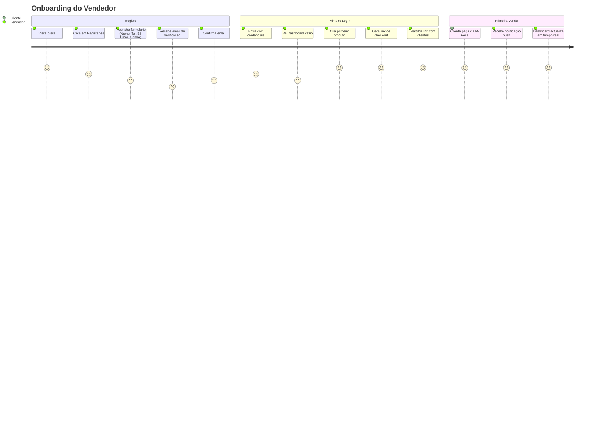
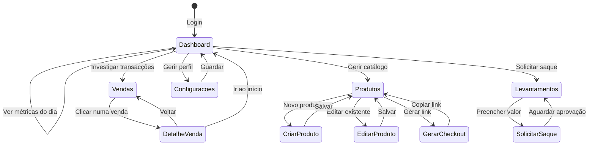
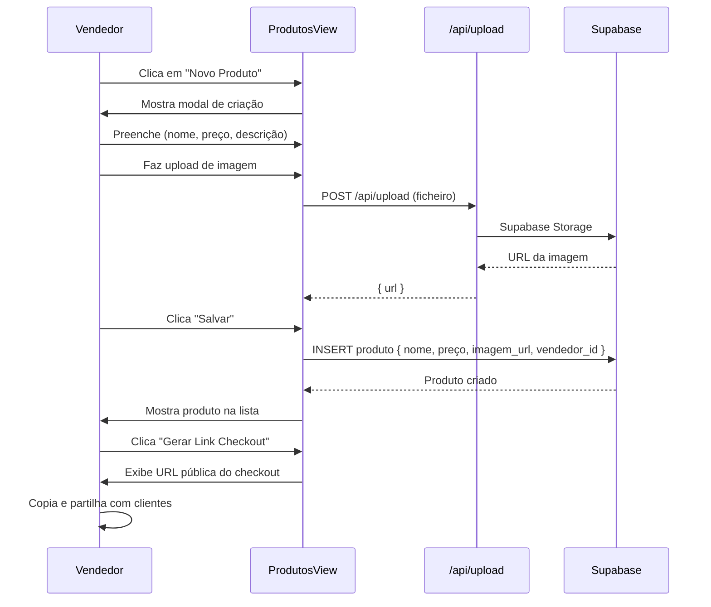
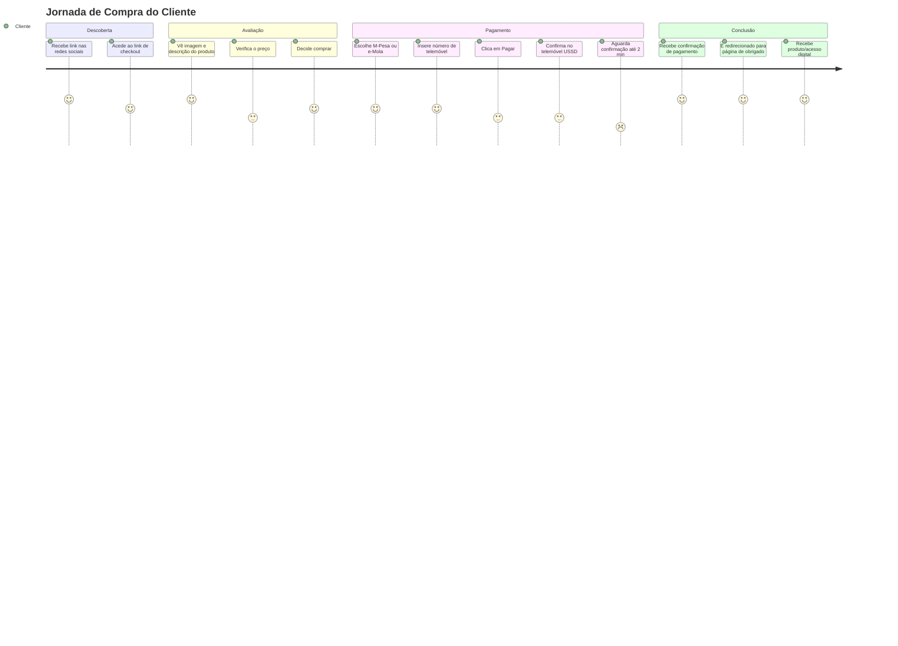
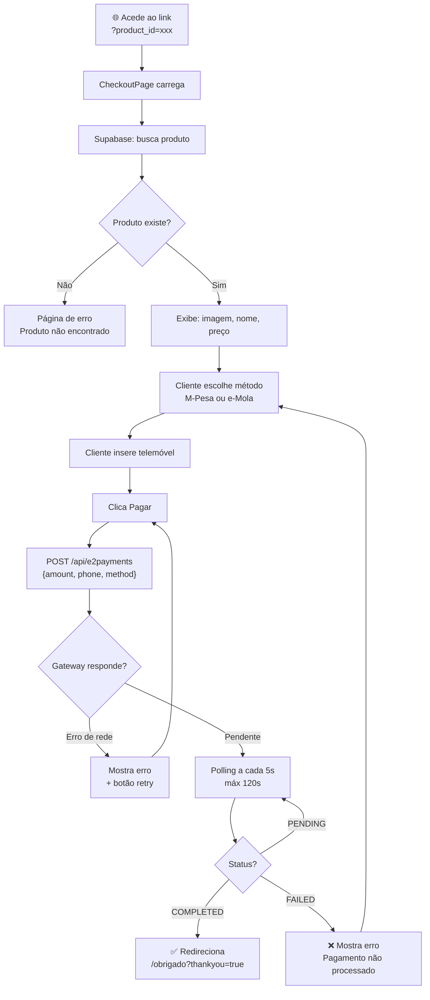
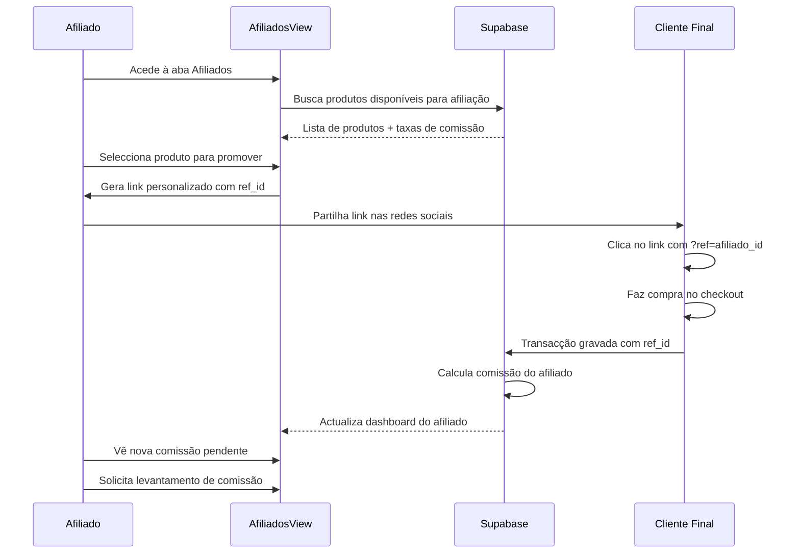
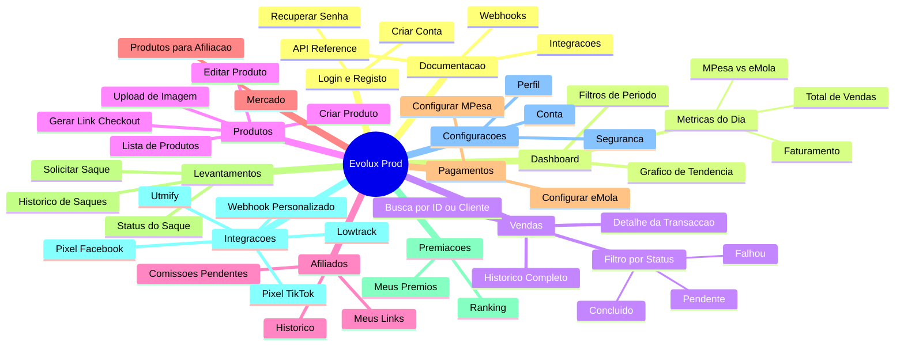
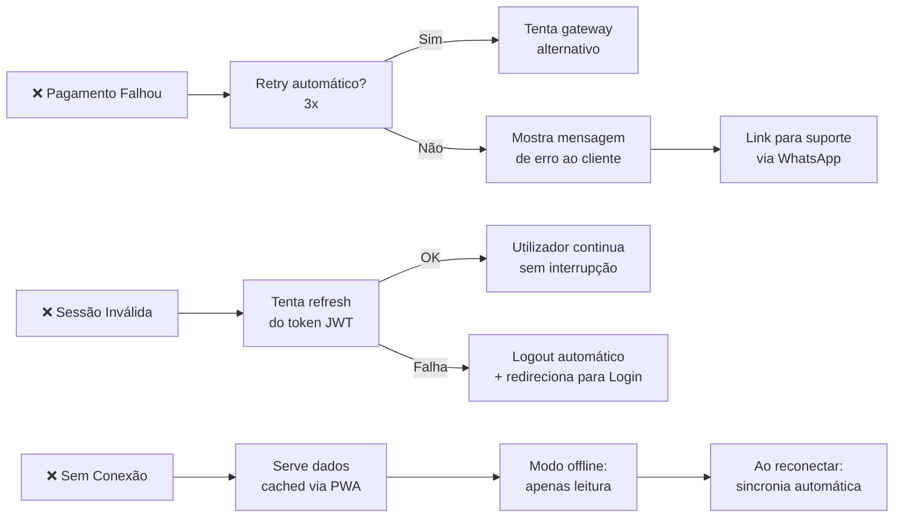

# Análise de Fluxo de Utilizador — InfroPay / Evolux Prod

> **Versão:** 1.0 | **Data:** Julho 2026  
> **Âmbito:** Análise completa dos fluxos de interação de todos os perfis de utilizador da plataforma

---

## 1. Perfis de Utilizador (Personas)

| Persona | Descrição | Objectivos Principais | Frequência de Uso |
|---|---|---|---|
| 🧑‍💼 **Vendedor** | Criador de conteúdo / empresário que vende produtos digitais em Moçambique | Criar produtos, acompanhar vendas, receber pagamentos | Diária |
| 🛒 **Cliente Final** | Comprador que acede ao link de checkout público | Pagar um produto digital via M-Pesa ou e-Mola | Única / Pontual |
| 🤝 **Afiliado** | Parceiro que promove produtos de outros vendedores | Ver comissões, partilhar links de afiliado | Semanal |
| 👑 **Administrador** | Gestor da plataforma | Aprovar contas, monitorizar transacções, gerir sistema | Diária |

---

## 2. Mapa de Fluxo Global (High-Level)

```mermaid
graph TD
    ENTRADA["🚪 Entrada na Plataforma"] --> AUTH{Autenticado?}

    AUTH -- Não --> LOGIN["LoginView\n(email + senha)"]
    AUTH -- Sim --> APP["App Principal"]

    LOGIN -- "Sucesso" --> APP
    LOGIN -- "Novo utilizador" --> REGISTO["Formulário de Registo\n(Nome, Tel, BI/NUIT, Email, Senha)"]
    REGISTO --> VERIFY["Verificação de Email\n(Supabase Auth)"]
    VERIFY --> LOGIN

    APP --> DASH["📊 Dashboard"]
    APP --> VENDAS["🧾 Vendas"]
    APP --> PRODUTOS["📦 Produtos"]
    APP --> AFILIADOS["🤝 Afiliados"]
    APP --> MERCADO["🛍️ Mercado"]
    APP --> PAGAMENTOS["💳 Pagamentos"]
    APP --> LEVANT["💸 Levantamentos"]
    APP --> PREMIOS["🏆 Premiações"]
    APP --> INTEGRACOES["🔧 Integrações"]
    APP --> CONFIG["⚙️ Configurações"]
    APP --> DOCS["📖 Documentação"]

    CHECKOUT_EXT["🌐 Link Público de Checkout"] --> CHECKOUT_PAGE["CheckoutPage\n(Acesso sem login)"]
    CHECKOUT_PAGE -- "Após pagamento" --> THANKYOU["ThankYouPage\n(/obrigado)"]
```

---

## 3. Fluxo Detalhado — Vendedor

### 3.1 Primeiro Acesso (Onboarding)

### 3.2 Fluxo Diário do Vendedor

### 3.3 Fluxo de Criação de Produto

---

## 4. Fluxo Detalhado — Cliente Final

### 4.1 Jornada Completa de Compra

### 4.2 Fluxo de Checkout (Detalhe Técnico)

---

## 5. Fluxo Detalhado — Afiliado

---

## 6. Mapa de Navegação (Sitemap)

---

## 7. Pontos de Fricção Identificados

### 🔴 Críticos (impactam conversão)

| # | Ponto de Fricção | Onde Ocorre | Impacto | Solução Sugerida |
|---|---|---|---|---|
| 1 | **Tempo de espera de pagamento** | CheckoutPage | Alto | Barra de progresso + feedback animado durante os 120s de polling |
| 2 | **Login falha silenciosamente** | LoginView | Alto | Mensagens de erro mais específicas (ex: "Email não confirmado") |
| 3 | **Sessão expirada sem aviso** | Toda a app | Médio | Aviso proactivo 5min antes da expiração + refresh automático |

### 🟡 Importantes (impactam retenção)

| # | Ponto de Fricção | Onde Ocorre | Impacto | Solução Sugerida |
|---|---|---|---|---|
| 4 | **Onboarding sem tutorial** | Primeiro login | Médio | Tour guiado step-by-step para novos utilizadores |
| 5 | **Criação de produto complexa** | ProdutosView | Médio | Dividir em steps: Info → Preço → Imagem → Revisão |
| 6 | **Checkout sem elementos de confiança** | CheckoutPage | Médio | Adicionar reviews/testemunhos opcionais |
| 7 | **Notificações push não activadas** | App em geral | Médio | Prompt mais claro com valor proposto |

### 🟢 Melhorias (impactam satisfação)

| # | Ponto de Fricção | Onde Ocorre | Impacto | Solução Sugerida |
|---|---|---|---|---|
| 8 | **Filtros de data manual** | VendasView | Baixo | Atalhos rápidos: "Esta semana", "Este mês" |
| 9 | **Sem exportação de dados** | VendasView | Baixo | Botão "Exportar CSV" para relatórios |
| 10 | **Levantamento sem status em tempo real** | SaqueView | Baixo | Notificação quando saque for aprovado/rejeitado |

---

## 8. Métricas de Sucesso por Fluxo

| Fluxo | Métrica Principal | Meta |
|---|---|---|
| Registo → Primeiro Produto | Tempo até criar 1º produto | < 5 minutos |
| Produto → Primeira Venda | Taxa de conversão do checkout | > 60% |
| Checkout → Confirmação | Taxa de pagamentos concluídos | > 85% |
| Venda → Notificação | Tempo de recepção da notificação | < 10 segundos |
| Levantamento → Recebimento | Tempo de processamento | < 24 horas |

---

## 9. Fluxo de Recuperação de Erros

---

## 10. Resumo Executivo

| Aspecto | Estado Actual | Prioridade de Melhoria |
|---|---|---|
| **Autenticação** | Funcional com fallback offline | 🟡 Melhorar mensagens de erro |
| **Checkout** | Funcional, M-Pesa + e-Mola | 🔴 Melhorar feedback de espera |
| **Dashboard** | Completo com gráficos | 🟢 Adicionar exportação |
| **Produtos** | Funcional | 🟡 Simplificar criação |
| **Notificações** | Implementadas via FCM | 🟡 Melhorar activação |
| **Afiliados** | Básico implementado | 🟡 Expandir funcionalidades |
| **Levantamentos** | Fluxo manual | 🔴 Automatizar aprovação |
| **Onboarding** | Ausente | 🔴 Criar tour guiado |

---

*Documento gerado em Julho 2026 — InfroPay / Evolux Prod*
