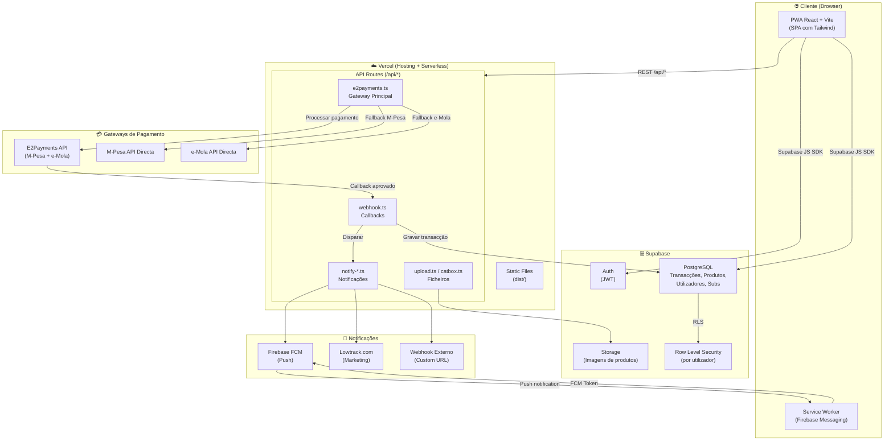
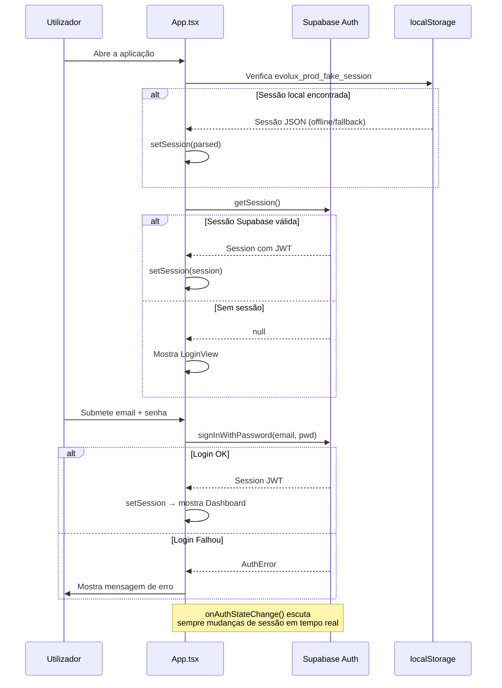
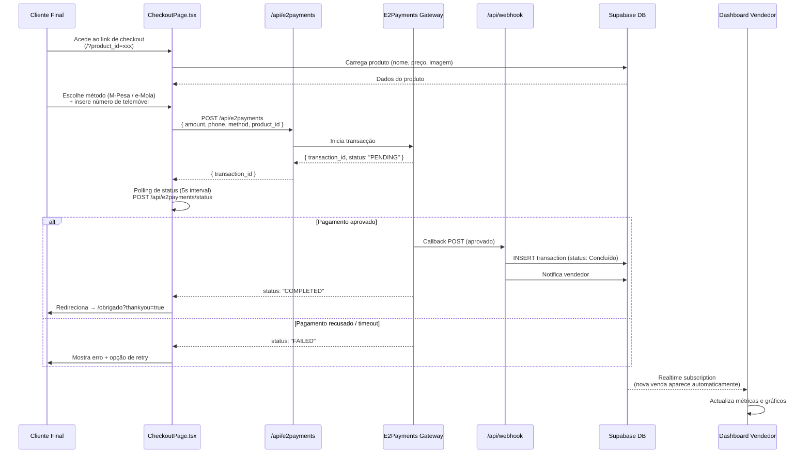
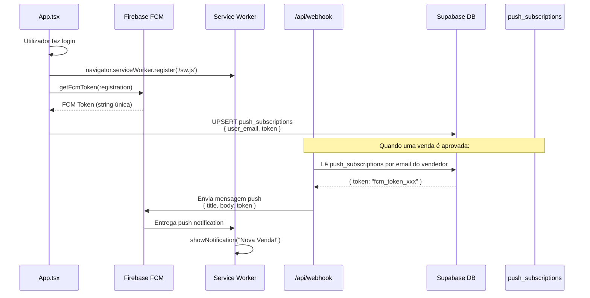
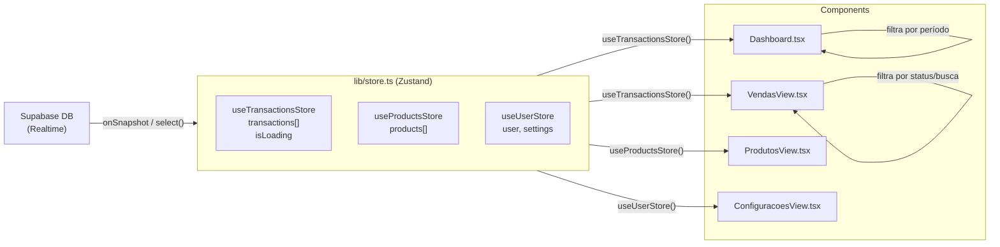

# InfroPay / Evolux Prod — Arquitectura & Fluxo Completo

## Estrutura Final do Projecto (após limpeza)

```
InfroPay/
│
├── 📄 .env                     # Variáveis locais (nunca versionar)
├── 📄 .env.example             # Template público de variáveis
├── 📄 .env.production          # Variáveis de produção (Vercel)
├── 📄 .env.vercel.local        # Override local para Vercel CLI
├── 📄 .gitignore
├── 📄 eslint.config.js
├── 📄 index.html               # Entry point HTML (Vite)
├── 📄 package.json
├── 📄 package-lock.json
├── 📄 postcss.config.js
├── 📄 README.md
├── 📄 tailwind.config.js
├── 📄 tsconfig.json
├── 📄 tsconfig.app.json
├── 📄 tsconfig.node.json
├── 📄 vercel.json              # Rotas + Serverless config
├── 📄 vite.config.ts           # PWA + build config
│
├── 📁 api/                     # Vercel Serverless Functions (backend)
│   ├── e2payments.ts           # ★ Gateway principal (M-Pesa + e-Mola)
│   ├── webhook.ts              # Receptor de callbacks de pagamento
│   ├── mpesa.ts                # Integração directa M-Pesa
│   ├── emola.ts                # Integração directa e-Mola
│   ├── notify-lowtrack.ts      # Notificações de venda → Lowtrack
│   ├── notify-webhook.ts       # Notificações de venda → webhook custom
│   ├── upload.ts               # Upload de imagens → Supabase Storage
│   ├── catbox.ts               # Upload externo → Catbox.moe
│   ├── payblack.ts             # Gateway alternativo
│   └── push/                   # Notificações push (FCM)
│
├── 📁 public/                  # Assets estáticos (servidos pelo Vite)
│   ├── logo.png
│   ├── evolux_logo.png
│   ├── mpesa_logo.png
│   ├── emola_logo.png
│   ├── utmify-logo.png
│   ├── firebase-messaging-sw.js  # Service Worker para FCM
│   ├── awards/
│   └── integrations/
│
├── 📁 scripts/                 # Scripts utilitários (execução manual)
│   ├── approve_pending.ts      # Aprovar transacções pendentes em lote
│   ├── clear-data.js           # Limpar dados de teste
│   ├── clear-data-admin.js     # Limpar dados (admin)
│   ├── trigger-lowtrack.js     # Disparar evento Lowtrack manualmente
│   ├── e2payments-test.ts      # Teste do gateway E2
│   └── test-lowtrack.ts        # Teste Lowtrack
│
├── 📁 src/                     # Código fonte React/TypeScript
│   ├── App.tsx                 # Root: auth + routing + layout
│   ├── main.tsx                # Entry React + PWA register
│   ├── index.css               # Estilos globais + Tailwind
│   ├── config.ts               # Constantes da aplicação
│   ├── assets/                 # Imagens internas (bundled)
│   ├── components/             # Componentes UI
│   │   ├── LoginView.tsx       # Autenticação
│   │   ├── Sidebar.tsx         # Navegação lateral
│   │   ├── Dashboard.tsx       # Painel principal
│   │   ├── VendasView.tsx      # Histórico de vendas
│   │   ├── ProdutosView.tsx    # Gestão de produtos
│   │   ├── CheckoutPage.tsx    # Página de checkout pública
│   │   ├── CheckoutModal.tsx   # Modal de pagamento
│   │   ├── PagamentosView.tsx  # Métodos de pagamento
│   │   ├── SaqueView.tsx       # Levantamentos/saques
│   │   ├── AfiliadosView.tsx   # Gestão de afiliados
│   │   ├── MercadoView.tsx     # Marketplace
│   │   ├── AnalyticsView.tsx   # Análise avançada
│   │   ├── FerramentasView.tsx # Integrações externas
│   │   ├── ConfiguracoesView.tsx # Configurações da conta
│   │   ├── PremiacoesView.tsx  # Sistema de prémios
│   │   ├── DocumentacaoView.tsx # Documentação API
│   │   ├── ThankYouPage.tsx    # Página pós-compra
│   │   └── Views.tsx           # Re-exportação de views
│   └── lib/                    # Lógica partilhada
│       ├── supabase.ts         # Cliente Supabase
│       ├── store.ts            # Estado global (Zustand)
│       ├── firebase.ts         # FCM + notificações push
│       ├── e2payments.ts       # Cliente gateway E2
│       ├── e2paymentsWrapper.ts # Wrapper de pagamentos
│       ├── paymentApi.ts       # Abstracção da API de pagamentos
│       ├── lowtrack.ts         # Cliente Lowtrack
│       ├── push.ts             # Lógica de push notifications
│       ├── clearLocalData.ts   # Limpeza de dados locais
│       ├── descriptionUtils.ts # Utilitários de descrição
│       └── utils.ts            # cn() e helpers gerais
│
├── 📁 supabase/                # Configuração Supabase
│   ├── config.toml             # Config do projecto Supabase
│   ├── migrations/             # Migrações SQL da base de dados
│   └── functions/              # Edge Functions Supabase
│       └── send-push/          # Edge function de push
│
└── 📁 _archive/                # Ficheiros arquivados (não usado no build)
    ├── flex-mola/
    ├── InfroPaycredentials/
    └── scratch/
```

---

## Diagrama de Arquitectura Geral



---

## Diagrama de Fluxo — Autenticação



---

## Diagrama de Fluxo — Checkout e Pagamento



---

## Diagrama de Fluxo — Notificações Push



---

## Diagrama de Fluxo — Estado Global (Zustand Store)



---

## Resumo da Limpeza Realizada

| Acção | Quantidade | Exemplos |
|---|---|---|
| ✅ Ficheiros eliminados | 24 | `old_index.css`, `test_*.js`, `build_error.txt`... |
| ✅ Pasta `Flex Mola/` | Arquivada | → `_archive/flex-mola/` |
| ✅ Pasta `InfroPaycredentials/` | Arquivada | → `_archive/InfroPaycredentials/` |
| ✅ Pasta `scratch/` | Arquivada | → `_archive/scratch/` |
| ✅ `api/e2payments-test.ts` | Movido | → `scripts/` |
| ✅ `api/test-lowtrack.ts` | Movido | → `scripts/` |
| ✅ `next.config.js` | Eliminado | Projecto usa Vite, não Next.js |

**Raiz final: 11 pastas essenciais + 17 ficheiros de configuração = projecto limpo e organizado.**
